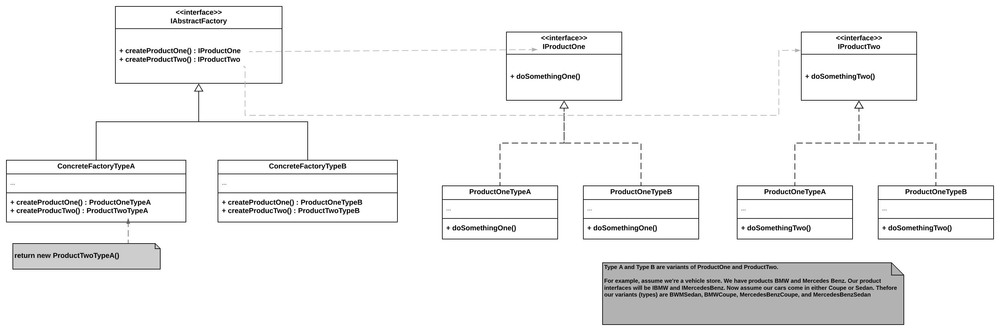
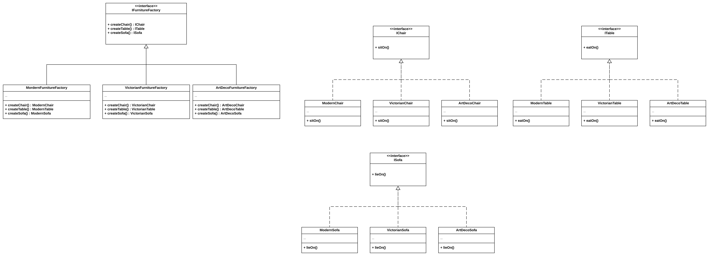

## Abstract Factory

The Abstract Factory pattern is a creational design pattern that lets you produce families of related objects without specifying their concrete classes. 

The Abstract Factory pattern suggests that we 
1. Firstly, declare the interfaces for each distinct product. Then for each variant of a product, you can make it implement the interface for that specific product. 
2. Secondly, declare the Abstract Factory, an interface with a list of creation methods for all **products**. These methods must return **abstract** product types (the interfaces we declared above)
3. Create a separate **factory** for each variant of the product that implements the **abstract factory** created above. A **factory** is a class that returns products of a particular kind

## Example
Assume you own a furniture store and in your store you produce `chairs`, `tables`, and `sofas`. For each product that you produce, you can either produce it in a `Modern`, `Victorian`, or `ArtDeco` variant. 

Following the steps defined above we have:
1. We declare the interfaces `IChair`, `ITable`, and `ISofa`. We then create the following classes:
    - `ModernChair`, `VictorianChair`, and `ArtDecoChair` that all 
    implement the `IChair` interface
    - `ModernTable`, `VictorianTable`, and `ArtDecoTable` all implement the `ITable` interface
    - `ModernSofa`, `VictorianSofa`, and `ArtDecoSofa` all implement the `ISofa` interface
2. We then declare the interface `IFurnitureFactory` with the methods
    - `createChair()` which returns an object of type `IChair`
    - `createTable()` which returns an object of type `ITable`
    - `createSofa()` which returns an object of type `ISofa`
3. Finally, we create the classes 
    - `MordernFurnitureFactory`, which implements the `IFurnitureFactory`, and the methods
        - `createChair()` returns a new `MordernChair` object
        - `createTable()` returns a new `MordernTable` object
        - `createSofa()` returns a new `MordernSofa` object
    - `VictorianFurnitureFactory`, which implements the `IFurnitureFactory`, and the methods
        - `createChair()` returns a new `VictorianChair` object
        - `createTable()` returns a new `VictorianTable` object
        - `createSofa()` returns a new `VictorianSofa` object
    - `ArtDecoFurnitureFactory`, which implements the `IFurnitureFactory`, and the methods
        - `createChair()` returns a new `ArtDecoChair` object
        - `createTable()` returns a new `ArtDecoTable` object
        - `createSofa()` returns a new `ArtDecoSofa` object

## Structure - UML Class Diagram

## Example UML Class Diagram

## Notes
- Use the Abstract Factory when your application needs to work with various families of related products.
- We achieve the Single Responsibility Principle in the sense that we extract the product creation code into a dedicated class. Making the code easier to support
- We achieve the Open/Closed Principle in the sense that we can introduce new products or new variants of products without having to modify the existing ones.
- It's easy to complicate the code since there are a lot of interfaces that get introduced when implementing the pattern