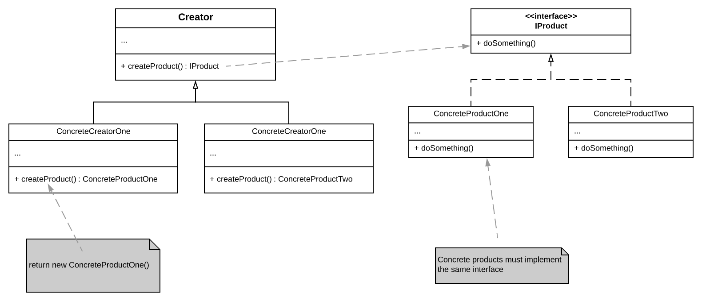
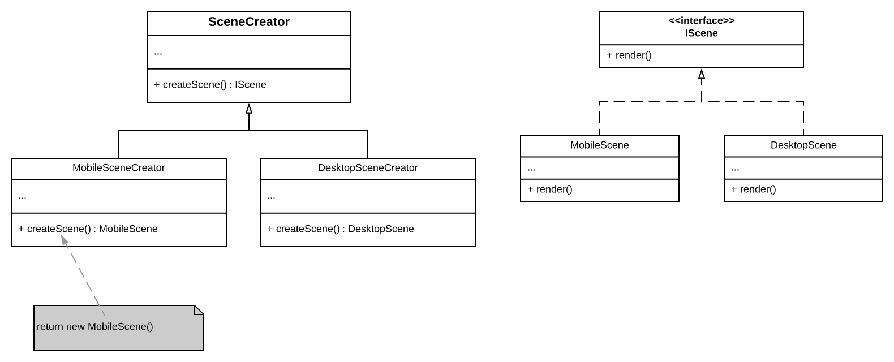

## Factory Method

Factory Method is a creational design pattern that provides an interface for creating objects in a superclass but allows subclasses to alter the type of objects that will be created. The objects returned by a factory method are often referred to as *products*.

"*Define an interface for creating objects, but let subclasses decide which class to instantiate. The Factory method lets a class defer instantiation to subclasses*"

The client code does not see a difference between the different products returned by the subclasses. The client treats the products as abstract objects of the same type (implementing a common interface). The client knows that the products are supposed to perform some action (behavior defined in the interface), but is not aware of the actual implementation of that behavior

## Example
Assume you are creating a game that can be played on multiple platforms, and each platform needs a specific scene. In the base class, `SceneCreator`, you can define a `createScene` method, which returns a scene of type `IScene`. You can have multiple subclasses of the base class, such as `MobileSceneCreator` and `DesktopSceneCreator`. The subclasses need to implement the `createScene` method and instantiate the appropriate scene.

## Structure - UML Class Diagram

## Example UML Class Diagram

## Notes
- We use the Factory Method when we do not know beforehand the exact types and dependencies of the objects we will be working with
    - Since the product construction is separated from the code that uses the product, it becomes easier to extend the product construction independently from the rest of the code.
    
        For example, to add a new scene for a different platform, we need to create a subclass that extends `SceneCreator` and override the `createScene` method.
- The Factory Method helps us avoid tight coupling between the creator and the concrete products. We can add new products without having to touch the creator class at all.
- Factory method helps us achieve the **Single Responsibility Principle**. Instead of having all the concrete objects instantiated in the creator class, we can have subclasses that are dedicated to creating specific types of objects. 
- Factory Method helps achieve the **Open-Closed Principle**. We can introduce new products without having to modify the existing ones.